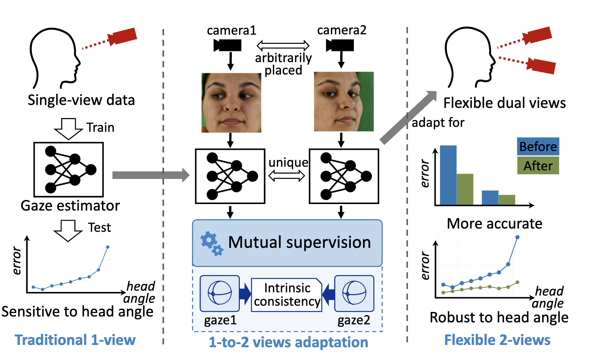
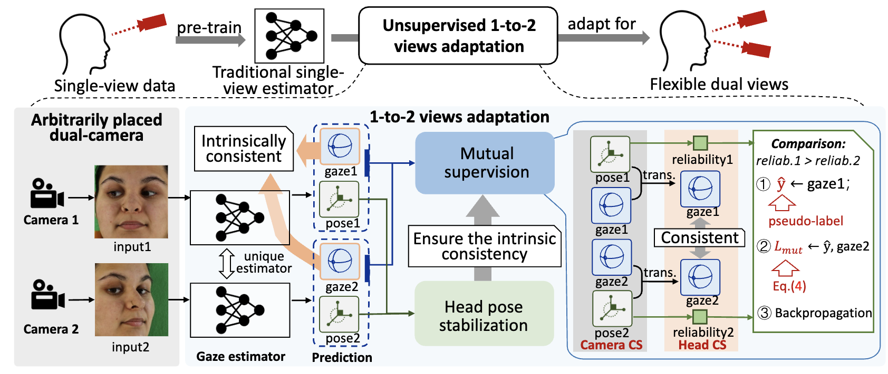
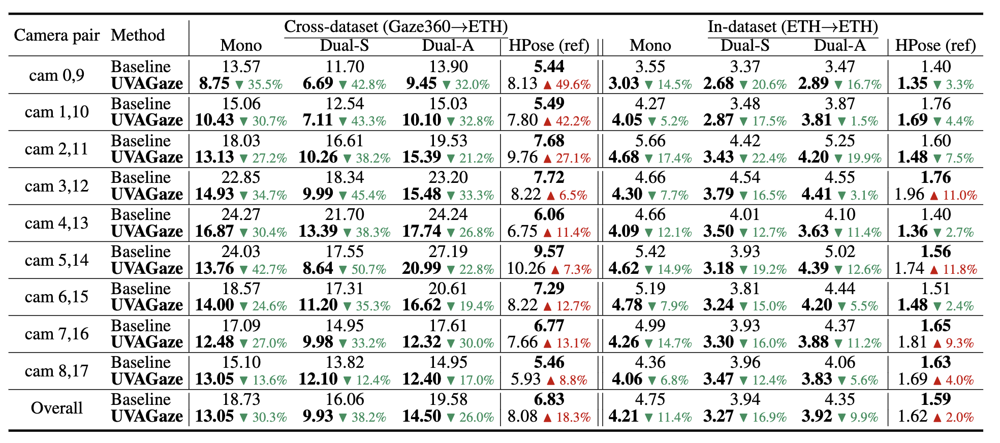

UVAGaze: Unsupervised 1-to-2 Views Adaptation for Gaze Estimation
---


Our paper is accepted by **AAAI-2024**

<div align=center>   </div>

**Picture:**  *Overview of the proposed Unsupervised 1-to-2 Views Adaption framework for adapting a single-view estimator to flexible dual views.*

<div align=center>   </div>

**Picture:**  *The proposed architecture.*

---

**Results**

<div align=center>   </div>


This repository contains the official PyTorch implementation of the following paper:

> **UVAGaze: Unsupervised 1-to-2 Views Adaptation for Gaze Estimation**<br>
Ruicong Liu and Feng Lu<br> <!-- >  https://arxiv.org/abs/  -->
> 
>**Abstract:**   Gaze estimation has become a subject of growing interest in recent research. Most of the current methods rely on single-view facial images as input. Yet, it is hard for these approaches to handle large head angles, leading to potential inaccuracies in the estimation. To address this issue, adding a second-view camera can help better capture eye appearance. However, existing multi-view methods have two limitations.  1) They require multi-view annotations for training, which are expensive.  2) More importantly, during testing, the exact positions of the multiple cameras must be known and match those used in training, which limits the application scenario. To address these challenges, we propose a novel 1-view-to-2-views (1-to-2 views) adaptation solution in this paper, the Unsupervised 1-to-2 Views Adaptation framework for Gaze estimation (UVAGaze). Our method adapts a traditional single-view gaze estimator for flexibly placed dual cameras. Here, the "flexibly" means we place the dual cameras in arbitrary places regardless of the training data, without knowing their extrinsic parameters. Specifically, the UVAGaze builds a dual-view mutual supervision adaptation strategy, which takes advantage of the intrinsic consistency of gaze directions between both views. In this way, our method can not only benefit from common single-view pre-training, but also achieve more advanced dual-view gaze estimation. The experimental results show that a single-view estimator, when adapted for dual views, can achieve much higher accuracy, especially in cross-dataset settings, with a substantial improvement of 47.0%.

## Resources

Material related to our paper is available via the following links:

- Paper: https://drive.google.com/file/d/1v3T3NksCPSV9k9H52xCCtDR_a-7VbWb-/view?usp=sharing
- Code: https://github.com/MickeyLLG/UVAGaze
- ETH-MV dataset:
- Gaze360 dataset: original http://gaze360.csail.mit.edu. We normalize it following [GazeHub@Phi-ai Lab](https://phi-ai.buaa.edu.cn/Gazehub).
- Pre-trained models and evaluation results: https://drive.google.com/file/d/1mkwKaY97WygAEoNrKEvcyhEP16Qc9Gxq/view?usp=sharing

## System requirements

* Only Linux is tested.
* 64-bit Python 3.8 installation. 

## Playing with pre-trained networks and training

### Data preparation

Please download the pre-trained models and ETH-MV dataset first. Preparing Gaze360 dataset is optional. Assuming the pre-trained models, ETH-MV, and Gaze360 are stored under ${DATA_DIR}. The structure of ${DATA_DIR} follows

```
- ${DATA_DIR}
    - AAAI24-UVAGaze-pretrain
        - 10.log
        - 20.log
        - Iter_10_eth.pt
        - Iter_20_gaze360.pt       
    - eth-mv
        - Image
        - Label
        - Label_train
        - Label_test
        - Label100k
        - Label100k_train
        - Label100k_test
    - Gaze360
        - Image
        - Label
```
Please run the following command to register the pre-trained model and data.
```
cp ${DATA_DIR}/AAAI24-UVAGaze-pretrain/* pretrain
mkdir data
ln -s ${DATA_DIR}/eth-mv data
ln -s ${DATA_DIR}/Gaze360 data
```

### 1-to-2 Views Adaptation (Training)

`run.sh` provides a complete procedure of training and testing.

We provide two optional arguments, `--stb` and `--pre`. They repersent two different network components, which could be found in our paper.

`--source` and `--target` represent the datasets used as the pre-training set and the dataset adapting to. It is recommended to use `gaze360, eth-mv-train` as `--source` and use `eth-mv` as `--target`. Please see `config.yaml` for the dataset configuration.

`--pairID` represents the index of dual-camera pair to adapt, ranging from 0 to 8.

`--i` represents the index of person which is used as the testing set. It is recommended to set it as -1 for using all the person as the training set.

`--pics` represents the number of samples for adaptation.

We also provide other arguments for adjusting the hyperparameters in our UVAGaze architecture, which could be found in our paper.

For example, you can run the code like:

```bash
python3 adapt.py --i -1 --cams 18 --pic 256 --bs 32  --pairID 0 --savepath eth2eth --source eth-mv100k-train --target eth-mv100k --gpu 0 --stb --pre
```

### Test

`--i, --savepath, --target, --pairID` are the same as training.

For example, you can run the code like:

```bash
python3 test_pair.py --pairID 0 --savepath eth2eth --target eth-mv100k --gpu 0
```

**Note**: the result printed by `test_pair.py` is **NOT** the final result on the specific dual-camera pair. It contains evaluation results on the **FULL** testing set.

We need to run `calc_metric.py` to get three metrics on the pair we adapt to. These three metrics are the final results, which are described in our paper.

```bash
python3 calc_metric.py --pairID 0 --savepath eth2eth --source eth-mv100k-train --target eth-mv100k
```

Please refer to `run.sh` for a complete procedure from training to testing.

## Citation

If you find this work or code is helpful in your research, please cite:

```latex
@inproceedings{liu2024uvagaze,
  title={UVAGaze: Unsupervised 1-to-2 Views Adaptation for Gaze Estimation},
  author={Liu, Ruicong and Lu, Feng},
  booktitle={Proceedings of the AAAI conference on artificial intelligence},
  year={2024}
}
```

## Contact

If you have any questions, feel free to E-mail me via: `liuruicong(at)buaa.edu.cn`